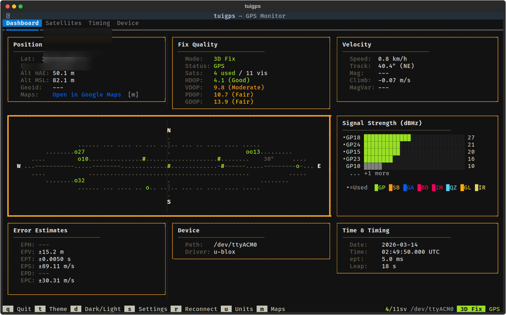

# tuigps

Terminal UI GPS monitoring tool built with [Textual](https://textual.textualize.io/) and [gpsd](https://gpsd.gitlab.io/gpsd/).




## Features

- **Dashboard** — position, fix status, velocity, sky plot, signal strength, error estimates, device info, and time in a single view
- **Satellites** — detailed table of all visible satellites with constellation breakdown
- **Timing** — GPS time, PPS offset and quality, TOFF, leap seconds, time accuracy
- **Device Config** — u-blox 8 configuration via ubxtool: platform model, nav rate, power mode, PPS, constellation enable/disable, and raw command input
- **Google Maps** — open current position in browser with `m` key or clickable link
- **Settings** — gpsd host/port, unit system (metric/imperial/nautical), coordinate format (DD/DMS/DDM), constellation filtering
- **Theming** — cycle through Textual themes with `t`, toggle dark/light with `d`

## Requirements

- Python 3.10+
- gpsd running and connected to a GPS receiver
- `python3-gps` system package (not available via pip)

```bash
sudo apt install gpsd gpsd-clients python3-gps
```

## Installation

```bash
python3 -m venv venv
source venv/bin/activate
pip install -e .
```

## Usage

```bash
tuigps
```

Or without installing:

```bash
python -m tuigps
```

### Key Bindings

| Key | Action               |
|-----|----------------------|
| `q` | Quit                 |
| `t` | Cycle theme          |
| `d` | Toggle dark/light    |
| `s` | Settings dialog      |
| `r` | Reconnect to gpsd    |
| `u` | Cycle units          |
| `m` | Open Google Maps     |

### Testing with simulated GPS

```bash
gpsfake -c 0.5 /usr/share/gpsd/sample.nmea
```

## Documentation

- [Dashboard](docs/dashboard.md) — main GPS overview
- [Satellites](docs/satellites.md) — satellite details table
- [Timing](docs/timing.md) — PPS and precision timing
- [Device Configuration](docs/device.md) — u-blox 8 receiver settings

## Architecture

All GPS data flows through a single `GPSData` dataclass. A threaded gpsd client reads from gpsd in a daemon thread and marshals updates to the Textual event loop via `App.call_from_thread()`. Each widget implements `update_gps_data(data: GPSData)` and renders using Rich `Text` objects.

## License

MIT
