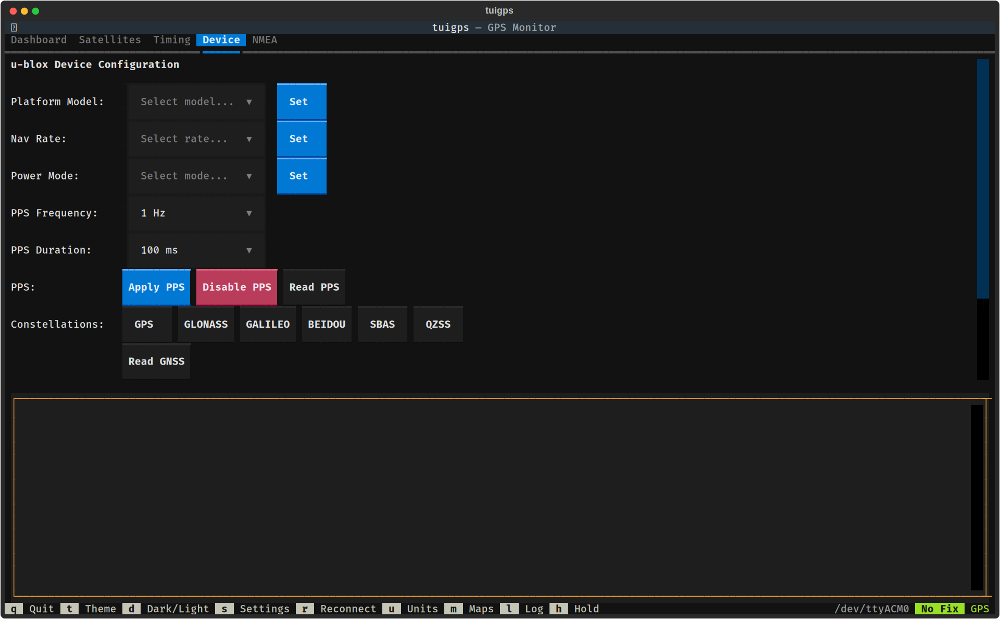

# Device Configuration

The Device tab provides u-blox 8 receiver configuration via ubxtool.

## Controls

### Platform Model
Sets the receiver's dynamic platform model, which optimizes the navigation engine for the expected use case:

| Model | Use Case |
|-------|----------|
| Portable | General purpose (default) |
| Stationary | Fixed position (timing, base station) |
| Pedestrian | Walking speed |
| Automotive | Car/vehicle |
| Sea | Marine |
| Airborne <1g/2g/4g | Aviation with varying dynamics |

### Nav Rate
Sets the navigation solution update rate. Higher rates increase CPU and power usage:
- 1 Hz (default), 2 Hz, 5 Hz, 10 Hz

### Power Mode
Configures the receiver's power management:
- **Full Power** — Maximum performance, highest power consumption
- **Balanced** — Reduced power with minimal performance impact
- **Interval** — Periodic tracking
- **Aggressive 1Hz/2Hz** — Aggressive power saving with fixed update rate

### PPS Configuration
Configures the Pulse Per Second timing output:

- **PPS Frequency** — Output pulse rate (1 Hz to 10 kHz)
- **PPS Duration** — Pulse width (10 us to 100 ms)
- **Apply PPS** — Sends a UBX-CFG-TP5 message with the selected frequency and duration
- **Disable PPS** — Turns off the timepulse output
- **Read PPS** — Reads current CFG-TP5 configuration from the receiver

### Constellations
Toggle buttons to enable/disable GNSS constellations on the receiver. Green indicates enabled. Available constellations: GPS, GLONASS, GALILEO, BEIDOU, SBAS, QZSS.

### System Clock

- **Set Clock (GPS)** — Sets the system clock from the latest GPS time, compensating for fix age. Uses D-Bus timedated (no sudo required on most desktop systems), with timedatectl and sudo -n fallbacks.
- **Set Clock (PPS)** — PPS-disciplined clock sync for sub-millisecond accuracy. Blocks on the kernel PPS ioctl (`PPS_FETCH`) to capture the exact timestamp of the next PPS pulse edge, computes the offset between the kernel timestamp and the GPS second the pulse marks, then applies a relative adjustment via D-Bus SetTime. Requires a `/dev/pps*` device (e.g., `pps_gpio` or `pps_ldisc` kernel module).

### Utility Buttons
- **Save Config** — Save current configuration to receiver flash (persists across power cycles)
- **Cold Boot** — Force a cold start (clears ephemeris, almanac, and position)
- **Read Nav** — Read current CFG-NAV5 navigation configuration
- **Read Rate** — Read current CFG-RATE update rate configuration
- **Read GNSS** — Read current CFG-GNSS constellation configuration

### Raw Command Input
Enter any ubxtool command arguments directly (e.g., `-p MON-VER` to read firmware version). Output appears in the log area below.

## Command Output
The bottom panel displays the output from all ubxtool commands, including responses from the receiver and any error messages.
