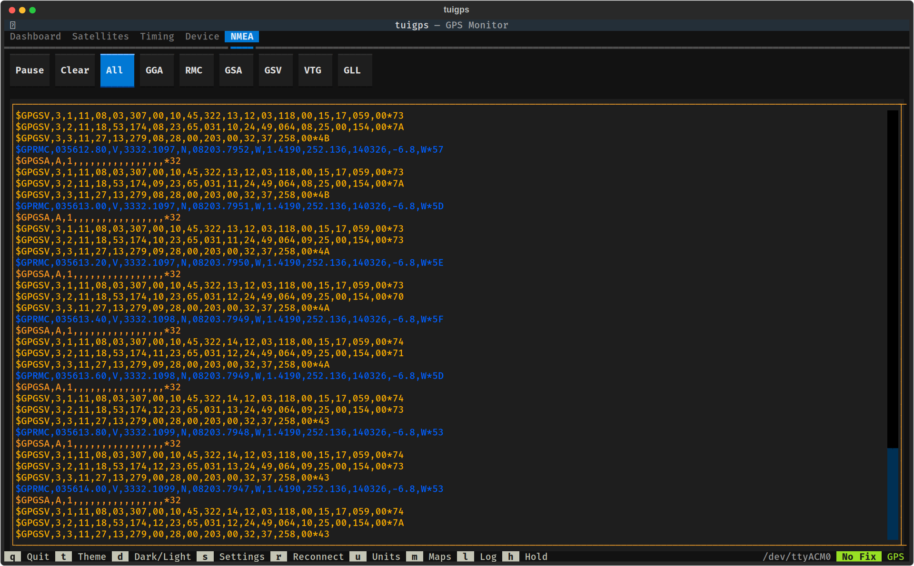

# NMEA Viewer

The NMEA tab displays a live stream of raw NMEA sentences from the GPS receiver.

## Controls

### Filter Buttons
Filter the displayed sentences by type:
- **All** — Show all NMEA sentences (default)
- **GGA** — GPS fix data (position, altitude, fix quality, satellites)
- **RMC** — Recommended minimum (position, speed, date/time)
- **GSA** — DOP and active satellites
- **GSV** — Satellites in view (elevation, azimuth, SNR)
- **VTG** — Track and ground speed
- **GLL** — Geographic position (latitude/longitude)

### Pause / Resume
Pause the live stream to examine sentences without them scrolling away. When paused, new sentences are buffered (up to 1000) and displayed when resumed.

### Clear
Clear the output log.

## Color Coding

NMEA sentences are color-coded by type for easy identification:
- GGA — green
- RMC — cyan
- GSA — yellow
- GSV — magenta
- VTG — blue
- GLL — white
- Other — dim

## Sentence Buffer

The viewer maintains a rolling buffer of the last 1000 sentences. When a filter is active, only matching sentences from the buffer are shown.
