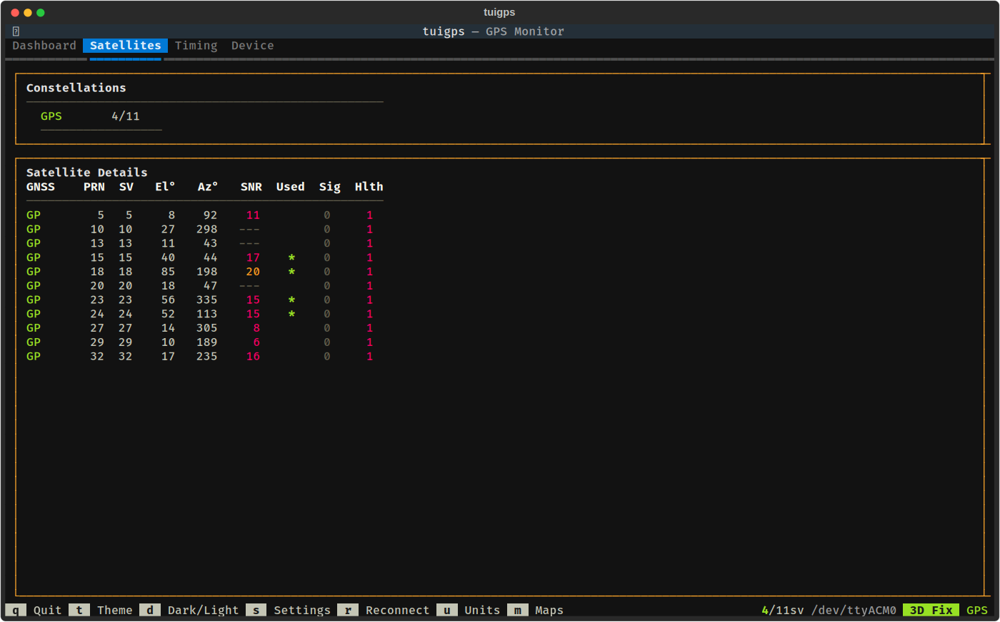

# Satellites

The Satellites tab provides detailed information about all visible GNSS satellites.

## Panels

### Constellations
Summary showing the number of satellites used vs visible for each active constellation (GPS, GLONASS, Galileo, BeiDou, SBAS, QZSS).

### Satellite Details Table
Full table of all visible satellites with the following columns:

| Column | Description |
|--------|-------------|
| GNSS   | Constellation identifier (GP=GPS, GL=GLONASS, GA=Galileo, BD=BeiDou, SB=SBAS, QZ=QZSS) |
| PRN    | Pseudo-random noise number |
| SV     | Space vehicle number |
| El     | Elevation angle in degrees (0-90) |
| Az     | Azimuth angle in degrees (0-360) |
| SNR    | Signal-to-noise ratio in dBHz |
| Used   | Whether the satellite is used in the position fix (*) |
| Sig    | Signal ID |
| Hlth   | Health status (1 = healthy) |

Satellites actively used in the fix are highlighted with a green asterisk in the Used column. SNR values are color-coded: green for strong signals, yellow for moderate, red for weak.
