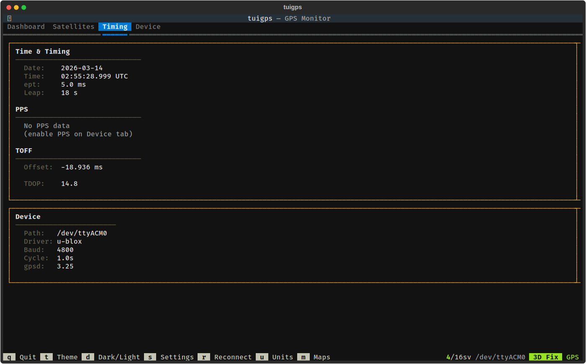

# Timing

The Timing tab provides detailed time and PPS (Pulse Per Second) information for precision timing applications.

## Panels

### Time & Timing
Detailed timing information including:

- **Date/Time** — Current GPS date and time in UTC
- **ept** — Estimated time error from the receiver
- **Leap** — Current leap seconds offset between GPS time and UTC

### PPS
Pulse Per Second timing data (requires PPS to be enabled on the Device tab):

- **Offset** — PPS offset between the GPS pulse and the system clock, displayed in nanoseconds, microseconds, or milliseconds depending on magnitude
- **Quality** — Color-coded quality indicator based on PPS offset (Excellent < 1us, Good < 10us, Fair < 100us, Poor > 100us)
- **Prec** — PPS precision (derived from the receiver's reported precision exponent)
- **qErr** — Quantization error reported by the receiver

If PPS is not enabled, a message directs you to the Device tab to enable it.

### TOFF
Time offset data from gpsd showing the difference between the GPS receiver's time and the system clock.

### TDOP
Time Dilution of Precision — a measure of how satellite geometry affects timing accuracy. Lower values indicate better timing geometry.

### Device
Shows the connected GPS device path, driver, baud rate, update cycle, and gpsd version.

## Enabling PPS
To see PPS data, navigate to the Device tab and use the Apply PPS button to configure the receiver's timepulse output. PPS data will then appear on this page automatically.
